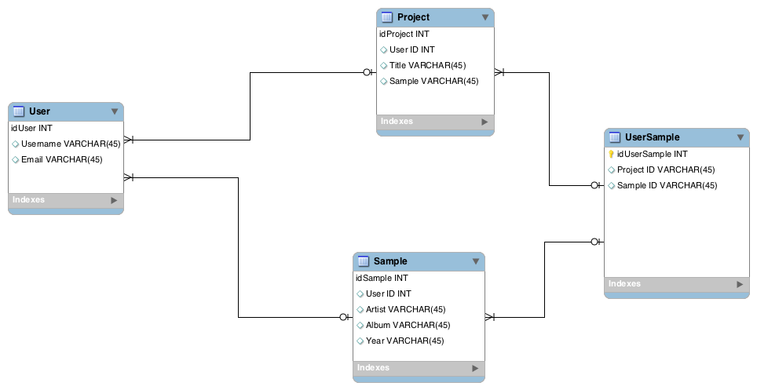

# Midstone

# Welcome to Trax!

## What is Trax?
Trax is an app designed for sample-based producers and beat-makers. This app will help you keep track of all your samples you find while digging and also be able to list your projects as you work on them. 

***
***

## How to download and run the application. :computer:

1. Clone the git repository from Github.
```
git clone https://github.com/ThraxHamilton/Midstone.git
```
2. Start the React server.
```
npm start
```

***
***

## Description of the different modules.
***
#### Login :lock:
Register a user or login.
***
### Samples :page_facing_up:
Create a new sample card with all the info you need when you find a new sample! Also scroll through the samples already in your library. 
### Projects :pushpin:
Add a new project to your list with the sample that you've used. 


***
***
## ERD
